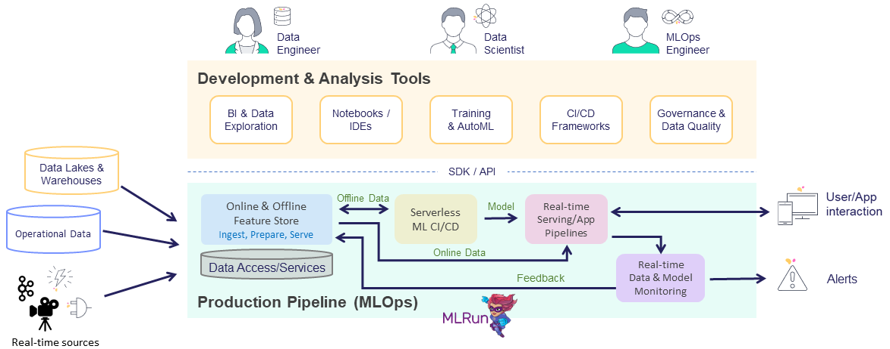

## MLRun - The Open Source MLOps Orchestration Framework

MLRun enables production pipeline design using a modular strategy, where the different parts contribute to a continuous, automated, and far simpler path from research and development to scalable production pipelines, without refactoring code, adding glue logic, or spending significant efforts on data and ML engineering.

MLRun uses **Serverless Function** technology: write the code once, using your preferred development environment and simple “local” semantics, and then run it as-is on different platforms and at scale. MLRun automates the build process, execution, data movement, scaling, versioning, parameterization, outputs tracking, CI/CD integration, deployment to production, monitoring, and more.

Those easily developed data or ML “functions” can then be published or loaded from a [marketplace](https://www.mlrun.org/marketplace/) and used later to form offline or real-time production pipelines with minimal engineering efforts.

 

Data preparation, model development, model and application delivery, and end to end monitoring are tightly connected: they cannot be managed in silos. This is where MLRun MLOps orchestration comes in. ML, data, and DevOps/MLOps teams collaborate using the same set of tools, practices, APIs, metadata, and version control.

**MLRun simplifies & accelerates the time to production.**

## Architecture 

MLRun is composed of the following layers:

- **[Feature Store](https://docs.mlrun.org/en/latest/feature-store/feature-store.html)** &mdash; collects, prepares, catalogs, and serves data features for development (offline) and real-time (online) usage for real-time and batch data. See also 
[Feature store: data ingestion](https://docs.mlrun.org/en/latest/feature-store/feature-store-data-ingestion.html) and [Feature store: data retrieval](https://docs.mlrun.org/en/latest/feature-store/feature-store-data-retrieval.html), as well as the [Feature Store tutorials](https://docs.mlrun.org/en/latest/feature-store/feature-store-tutorials.html).
- **[ML CI/CD pipeline](.docs//projects/ci-integration)** &mdash; automatically trains, tests, optimizes, and deploys or updates models using a snapshot of the production 
data (generated by the feature store) and code from the source control (Git).
- **[Real-Time Serving Pipeline](https://docs.mlrun.org/en/latest/serving/serving-graph.html)** &mdash; Rapid deployment of scalable data and ML pipelines using real-time serverless technology, including 
the API handling, data preparation/enrichment, [model serving](https://docs.mlrun.org/en/latest/serving/build-graph-model-serving.html), ensembles, driving and measuring actions, etc.
- **[Real-Time monitoring and retraining](https://docs.mlrun.org/en/latest/model_monitoring/index.html)** &mdash; monitors data, models, and production components and provides a feedback loop for exploring production data, identifying drift, alerting on anomalies or data quality issues, triggering re-training jobs, measuring business impact, etc.

## Get started

It's easy to start using MLRun: 
1. Install the MLRun service [locally using Docker](https://docs.mlrun.org/en/latest/install/local-docker.html) or [over Kubernetes Cluster](https://docs.mlrun.org/en/latest/install/kubernetes.html). Alternatively, you can use [Iguazio's managed MLRun service](https://www.iguazio.com/docs/latest-release/)
2. [Set up your client environment](https://docs.mlrun.org/en/latest/install/remote.html) to work with the service. 
3. Follow the [Quick Start tutorial](https:///docs.mlrun.org/en/latest/quick-start/quick-start.html) and [Additional Tutorials and Examples](https://docs.mlrun.org/en/latest/howto/index.html) to learn how to use MLRun to develop and deploy machine learning applications to production. 

For hands-on learning, try the [MLRun Katakoda Scenarios](https://www.katacoda.com/mlrun). And you can watch the [Tutorial on Youtube](https://www.youtube.com/embed/O6g1pJJ609U) to see the flow in action.

## MLRun documentation

Read more in the MLRun documentation, including:
- MLRun basics
   - [What is MLRun?](https://docs.mlrun.org/en/latest/index.html)
   - [Quick-Start Guide](https://docs.mlrun.org/en/latest/quick-start/quick-start.html)
   - [Tutorials and examples](https://docs.mlrun.org/en/latest/howto/index.html)
   - [Installation and setup guide](https://docs.mlrun.org/en/latest/install.html)
- Concepts
   - [Projects](https://docs.mlrun.org/en/latest/projects/project.html)
   - [MLRun serverless functions](https://docs.mlrun.org/en/latest/concepts/functions-concepts.html)
   - [Data stores and data items](https://docs.mlrun.org/en/latest/concepts/data-feature-store.html)
   - [Feature store](https://docs.mlrun.org/en/latest/feature-store/feature-store.html)
   - [Runs, functions, and workflows](https://docs.mlrun.org/en/latest/concepts/runs-experiments-workflows.html)
   - [Artifacts and models](https://docs.mlrun.org/en/latest/store/artifacts.html)
   - [Deployment and monitoring](https://docs.mlrun.org/en/latest/concepts/deployment-monitoring.html)
- Working with data
   - [Data ingestion](https://docs.mlrun.org/en/latest/feature-store/feature-store-data-ingestion.html)
   - [Data retrieval](https://docs.mlrun.org/en/latest/feature-store/feature-store-data-retrieval.html)
   - [Tutorials](https://docs.mlrun.org/en/latest/feature-store/feature-store-tutorials.html)
- Develop Functions and models
   - [Creating and using functions](https://docs.mlrun.org/en/latest/runtimes/functions.html)
   - [Run, track, and compare jobs](https://docs.mlrun.org/en/latest/runtimes/run-track-compare-jobs.html)
- Deploy ML applications
   - [Real-time serving pipelines (graphs)](https://docs.mlrun.org/en/latest/serving/serving-graph.html)
   - [Model serving pipelines](https://docs.mlrun.org/en/latest/serving/build-graph-model-serving.html)
   - [CI/CD, rolling upgrades, git](https://docs.mlrun.org/en/latest/model_monitoring/ci-cd-rolling-upgrades-git.html)
- References
   - [API](https://docs.mlrun.org/en/latest/api/index.html)
   - [CLI](https://docs.mlrun.org/en/latest/cli.html)
   - [Glossary](https://docs.mlrun.org/en/latest/glossary.html)
