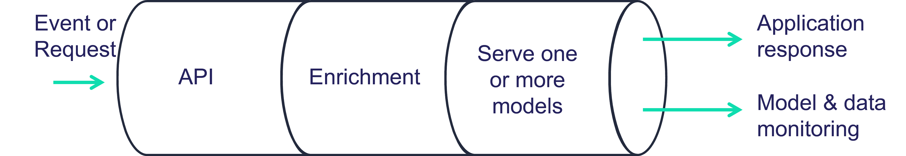

.. _serving:

Real-time serving pipelines (graphs)
========================================

Overview
########

MLRun serving graphs allow to easily build real-time data processing and 
advanced model serving pipelines, and deploy them quickly to production with
minimal effort.

The serving graphs can be composed of pre-defined graph blocks (model servers, routers,
ensembles, data readers and writers, data engineering tasks, validators, etc.), 
or from native python classes/functions. Graphs can auto-scale and span multiple function 
containers (connected through streaming protocols).

Graphs can run inside your IDE or Notebook for test and simulation and can be deployed 
into production serverless pipeline with a single command. Serving Graphs are built on 
top of `Nuclio <https://github.com/nuclio/nuclio>`_ (real-time serverless engine), MLRun Jobs, 
`MLRun Storey <https://github.com/mlrun/storey>`_ (native Python async and stream processing engine), 
and other MLRun facilities. 

MLRun graph capabilites includes:

* Easily build and manage complex graphs
* Real-time serverless engine for optimized utilization (auto scale up/down)
* Support advanced applications including streaming, machine learning, deep-learning, NLP
* Debug in the IDE/Notebook, deploy to production using a single command

Accelerate performance and time to production
*************************************************

The underline Nuclio serverless engine uses a high-performance parallel processing 
engine that maximize the utilization of CPUs and GPUs, supports 13 protocols and 
invocation methods (for example, HTTP, Cron, Kafka, Kinesis), and dynamic auto-scaling for 
http and streaming. Nuclio and MLRun support the full life cycle, including auto-
generation of micro-services, APIs, load-balancing, logging, monitoring, and 
configuration management, allowing developers to focus on code, and deploy faster 
to production with minimal work.
 
**See the following sections for details and examples**

.. toctree::
   :maxdepth: 2
   :glob:

   graph/graph-overview
   graph/use-cases
   model-serving/serving-graph
   graph/writing-custom-steps
   graph/available-steps
   graph/best-practices-troubleshooting
   model-serving/build-graph-model-serving
   graph/demos
